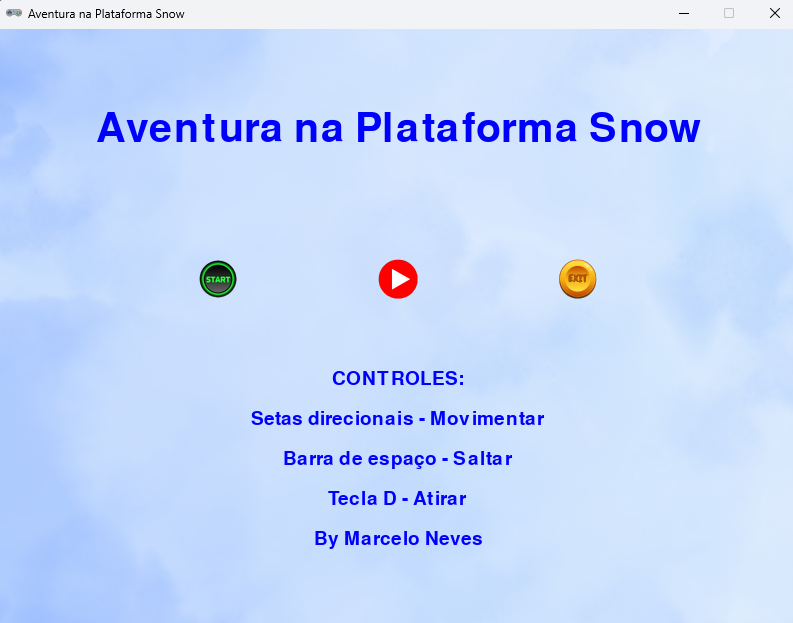
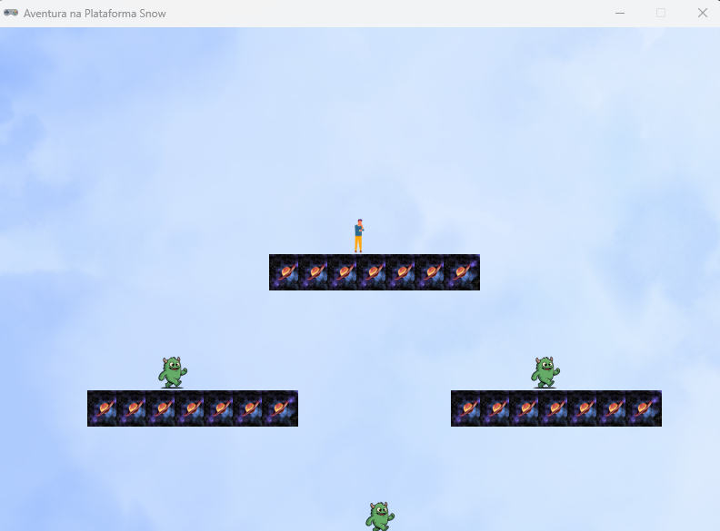
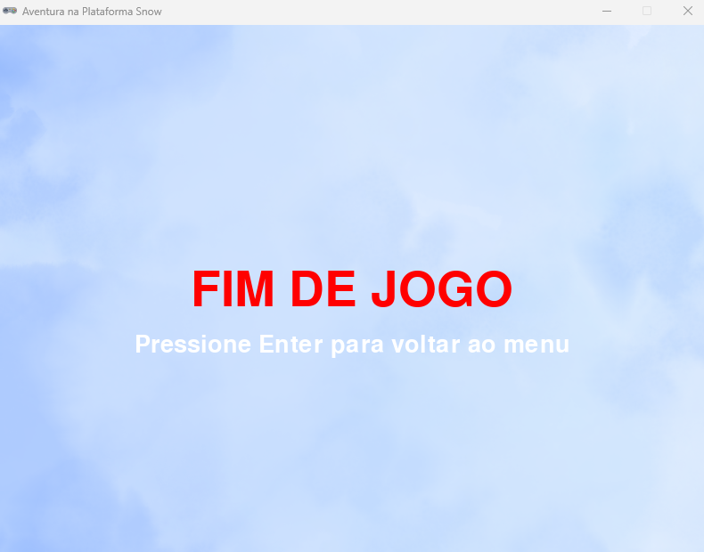

# Aventura na Plataforma Snow

Este é um projeto de jogo de plataforma simples desenvolvido em Python utilizando a biblioteca Pygame Zero. O objetivo do jogo é controlar um personagem para navegar pelas plataformas, derrotar inimigos e alcançar a vitória.

## Funcionalidades

* **Controle de Personagem:** Movimentação para esquerda e direita, pulo e ataque.
* **Plataformas:** O jogador pode interagir com diversas plataformas no cenário.
* **Inimigos:** Inimigos com padrões de patrulha simples que o jogador deve derrotar.
* **Sistema de Animação:** Animações básicas para o jogador e inimigos (ocioso, correndo, andando).
* **Menu Principal:** Um menu interativo com opções para iniciar o jogo, controlar a música e sair.
* **Música e Efeitos Sonoros:** Trilha sonora de fundo e efeitos sonoros para ações como pular e atacar.
* **Tela de Fim de Jogo/Vitória:** Mensagens indicando o fim do jogo ou a vitória.

## Como Jogar

1.  **Requisitos:** Certifique-se de ter o Pygame Zero instalado. Você pode instalá-lo via pip:
    ```bash
    pip install pgzero
    ```
2.  **Executar o Jogo:** Salve o código fornecido como um arquivo `.py` (por exemplo, `main.py`) e execute-o a partir do seu terminal:
    ```bash
    pgzrun main.py
    ```

### Controles

* **Setas direcionais (Esquerda/Direita):** Movimentar o personagem.
* **Barra de Espaço:** Saltar.
* **Tecla D:** Atacar (lançar um projétil).
* **Enter (na tela de Game Over/Vitória):** Voltar ao menu principal.

## Estrutura do Código

O código está organizado nas seguintes seções principais:

1.  **Constantes e Configuração:** Define as dimensões da janela, título e parâmetros de jogo como gravidade e velocidade.
2.  **Classes Auxiliares:**
    * `AnimatedCharacter`: Uma classe base para personagens com animações.
    * `Player`: A classe do jogador, estendendo `AnimatedCharacter` com lógica de movimento, pulo e ataque.
    * `Enemy`: A classe do inimigo, estendendo `AnimatedCharacter` com lógica de patrulha.
    * `Button`: Uma classe para criar botões interativos no menu.
3.  **Inicialização do Jogo:** Funções para configurar o estado inicial do jogo, incluindo plataformas, jogador e inimigos. Define também os botões do menu.
4.  **Funções do Jogo (`draw`, `update`, `on_mouse_move`, `on_mouse_down`, `on_key_down`):**
    * `draw()`: Responsável por desenhar todos os elementos do jogo na tela.
    * `update(dt)`: Lógica de atualização do jogo, incluindo movimento de personagens, detecção de colisões e transições de estado.
    * `on_mouse_move()`, `on_mouse_down()`, `on_key_down()`: Funções de manipulação de entrada do usuário.

## Assets (Ativos)

Este projeto requer os seguintes ativos (imagens e sons) para funcionar corretamente. Certifique-se de que eles estejam localizados nas pastas apropriadas (ex: `images/` para imagens, `sounds/` para sons) no mesmo diretório do seu script Python:

* **Imagens:**
    * `background.png`
    * `platform_tile.png`
    * `player_idle/0.png`, `player_idle/1.png`
    * `player_run/0.png`, `player_run/1.png`
    * `enemy_walk/0.png`, `enemy_walk/1.png`
    * `button_start.png`, `button_start_hover.png`
    * `button_music_on.png`, `button_music_off.png`
    * `button_exit.png`, `button_exit_hover.png`
* **Sons:**
    * `jump_sound.ogg` (ou `.wav`)
    * `hit_sound.ogg` (ou `.wav`)
    * `attack_hit.ogg` (ou `.wav`)
    * `menu_music.ogg` (ou `.mp3`)
    * `background_music.ogg` (ou `.mp3`)

## Imagens do Projeto

Aqui você pode adicionar duas imagens que representem seu projeto, como capturas de tela do jogo ou design de personagens.






## Desenvolvedor

Marcelo Neves
